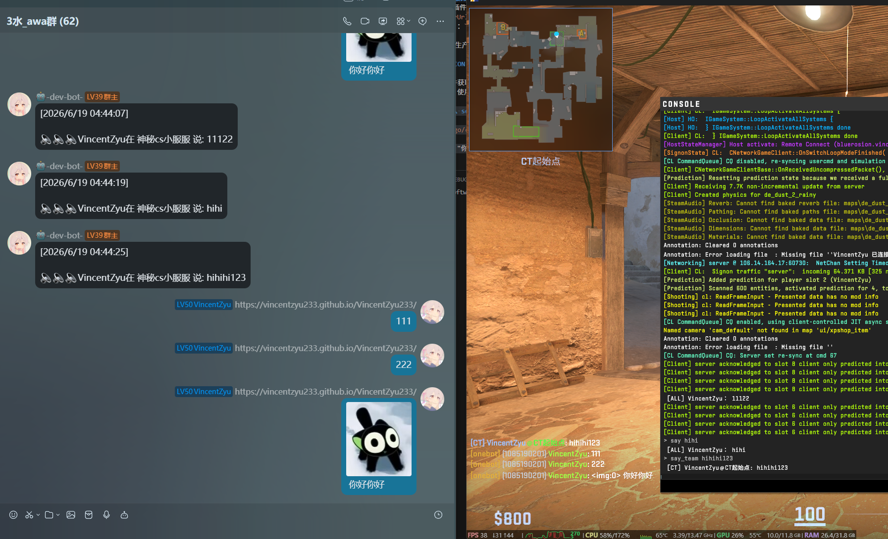
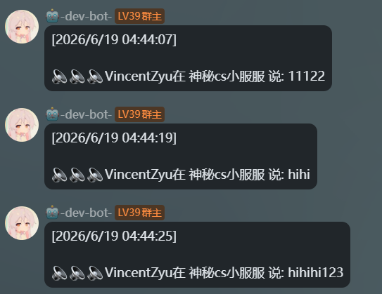
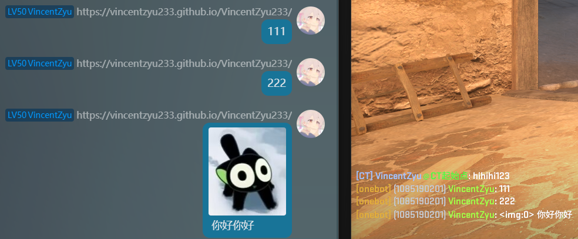
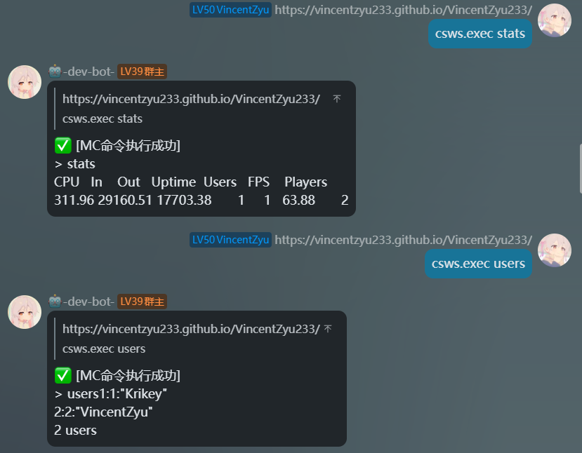

> **[📖 English](README.md)**
> **[📖 简体中文(大陆)](README.zh-cn.md)**


[](https://github.com/VincentZyuApps/CounterStrikeSharpListenerWsServer)
[](https://gitee.com/vincent-zyu/CounterStrikeSharpListenerWsServer)

[](https://github.com/roflmuffin/CounterStrikeSharp)
[](https://dotnet.microsoft.com/)

[](https://qm.qq.com/q/4vjto4V7Di)

<p>💬 Plugin usage / 🐛 Bug reports / 👨‍💻 Plugin dev discussion, join QQ group: <b>1085190201</b> 🎉</p>
<p>💡 Mention me in the group for faster replies ~ ✨</p>

# 🎮 🔌 🌐 CounterStrikeSharpListenerWsServer

A Counter-Strike 2 server plugin that bridges CS2 events to external chat platforms (QQ / Discord / Kook / Telegram) via WebSocket. Works together with [koishi-plugin-mclistener-ws-client](https://github.com/VincentZyuApps/koishi-plugin-mclistener-ws-client) to achieve cross-platform group ↔ server chat interoperability.

Built on [CounterStrikeSharp](https://github.com/roflmuffin/CounterStrikeSharp), written in C# (.NET 10). **Zero extra NuGet dependencies** — uses only `System.Net.WebSockets` from the BCL.






## ✨ Features

- 🚪 **Player Join/Leave Broadcast** — announces when players enter or exit the CS2 server
- 💬 **Player Chat Forwarding** — forwards in-game chat messages to chat platforms
- 📨 **Group Message Relay** — forwards messages from QQ/Discord/etc. to CS2 in-game chat
- 🔐 **Token Authentication** — optional `?token=xxx` URL parameter for client verification
- 🌍 **Cross-Platform** — runs on both Windows and Linux
- ⚙️ **Auto-Generated Config** — first run creates `config.json` with sensible defaults

## 🏗️ Architecture

```
┌──────────────────┐       WebSocket JSON        ┌──────────────────────────────┐
│   Koishi Bot     │ ◄══════════════════════════► │  CounterStrikeSharpListener  │
│ (QQ/Discord/...) │   ws://host:port?token=xxx   │         WsServer             │
└──────────────────┘                              └───────────────┬──────────────┘
                                                                  │
                                                      ┌───────────┴───────────┐
                                                      │      CS2 Server       │
                                                      │ (CounterStrikeSharp)  │
                                                      └──────────────────────┘
```

## 🏃 Quick Start

### 📦 Deploy to Server

1. **Install Metamod:Source**  
   See https://cs2.poggu.me/metamod/installation/  
   Download the Linux build and extract to the `csgo/` directory

   Structure after extraction:
   ```
   csgo/addons/
   └── metamod/
   ```

2. **Install CounterStrikeSharp**  
   Download the [with-runtime release](https://github.com/roflmuffin/CounterStrikeSharp/releases)  
   Merge the `addons/` folder into `csgo/`

   Structure after merging:
   ```
   csgo/
   └── addons/
     ├── metamod/
     └── counterstrikesharp/
         ├── api/
         ├── dotnet/
         └── plugins/
   ```

3. **Add the Plugin**
   CSS requires plugins in `plugins/<PluginName>/<PluginName>.dll` (directory name = DLL filename).
   Download the `.dll` from [Releases](https://github.com/VincentZyuApps/CounterStrikeSharpListenerWsServer/releases/latest):
   ```bash
   # Default Steam path is usually under ~/.local
   cd "path/to/Steam/steamapps/common/Counter-Strike Global Offensive/game"
   TAG=<latest version tag>
   PLUGIN_DIR=csgo/addons/counterstrikesharp/plugins/CounterStrikeSharpListenerWsServer
   mkdir -p $PLUGIN_DIR
   cd $PLUGIN_DIR
   wget "https://github.com/VincentZyuApps/CounterStrikeSharpListenerWsServer/releases/download/$TAG/CounterStrikeSharpListenerWsServer-$TAG.dll"
   mv CounterStrikeSharpListenerWsServer-$TAG.dll CounterStrikeSharpListenerWsServer.dll
   ```

   Final plugin structure:
   ```
   plugins/
   └── CounterStrikeSharpListenerWsServer/
       └── CounterStrikeSharpListenerWsServer.dll
   ```

4. **Start the Server**
   ```bash
   ./cs2 -dedicated -game csgo +map de_dust2 +sv_lan 1
   ```

   You should see `[Plugin] WS Server started on 0.0.0.0:60618` in the console.
   A default `config.json` will be generated automatically.

5. **Configure the Koishi Client**
   In your Koishi plugin config, set:
   - `wsServerUrl`: `ws://<CS2_SERVER_IP>:60618`
   - `wsToken`: `test12345` (match with `config.json`)

   **Important:** Change the default token for production use!

### 📡 Enable RCON (Optional)

RCON allows the plugin to receive text output from commands like `status` or `list` (via `ExecCommandMode: "rcon-relay"`).

#### Method 1: Write to server.cfg (Recommended)

Create or edit `csgo/cfg/server.cfg`:
```
rcon_password "your-strong-password"
log on
sv_logecho 1
```
The plugin uses the same password in its `RconPassword` config. Restart after editing.

#### Method 2: Write to startup script

Add to your server startup command line (`cs2ds.sh` or similar):
```bash
+rcon_password "your-strong-password" \
+sv_logecho 1
```

> ⚠️ RCON uses **TCP** on the game port. Ensure your firewall allows TCP (not only UDP) on the configured port (`27015` by default).
>
> ℹ️ **Some Linux Distros(mainly in Debian/Ubuntu based) note:** On Linux, CS2 RCON may bind to `127.0.1.1` instead of `127.0.0.1` (see `/etc/hosts` hostname mapping). Test with `nc -zv 127.0.0.1 <port>` first; if refused, try `127.0.1.1`. To force RCON onto all interfaces, add `-ip 0.0.0.0` to `cs2ds.sh` — **not recommended for security**.

## ⚙️ Configuration

On first startup, `config.json` is auto-generated at `csgo/addons/counterstrikesharp/plugins/CounterStrikeSharpListenerWsServer/config.json`:

```json
{
  "_comment_logLevel": "📋 日志等级：silent | fatal | error | warn | info | debug | trace",
  "logLevel": "info",
  "Host": "0.0.0.0",
  "Port": 60618,
  "WsToken": "test12345",
  "enablePlayerJoinBroadcast": true,
  "enablePlayerLeaveBroadcast": true,
  "enablePlayerChatBroadcast": true,
  "enableReceiveGroupMessage": true,
  "GroupMessageFormat": "[{group_name}]({group_id}) {nickname}: {message}",
  "BotSuffix": " (bot)",
  "PlayerSuffix": " (player)",
  "PlayerBroadcastScope": "player",
  "ExecCommandMode": "disabled",
  "RconHost": "127.0.0.1",
  "RconPort": 27015,
  "RconPassword": "",
  "RconTimeoutMs": 5000
}
```

| Field | Type | Default | Description |
|-------|------|---------|-------------|
| `logLevel` | string | `info` | Log level: `silent` / `fatal` / `error` / `warn` / `info` / `debug` / `trace` |
| `Host` | string | `0.0.0.0` | WebSocket server listen address |
| `Port` | int | `60618` | WebSocket server listen port |
| `WsToken` | string | `test12345` | Auth token (empty = no auth) |
| `enablePlayerJoinBroadcast` | bool | `true` | Broadcast player join events |
| `enablePlayerLeaveBroadcast` | bool | `true` | Broadcast player leave events |
| `enablePlayerChatBroadcast` | bool | `true` | Broadcast player chat to chat platforms |
| `enableReceiveGroupMessage` | bool | `true` | Forward group messages to in-game chat |
| `GroupMessageFormat` | string | `[{group_name}]({group_id}) {nickname}: {message}` | Template for in-game group messages |
| `BotSuffix` | string | ` (bot)` | Bot name suffix (empty = none) |
| `PlayerSuffix` | string | ` (player)` | Player name suffix (empty = none) |
| `PlayerBroadcastScope` | string | `player` | Player event broadcast scope: `player` (players only) / `bot` (bots only) / `both` (all) |
| `ExecCommandMode` | string | `disabled` | `disabled` (off) / `csharp-native` (engine, no output) / `rcon-relay` (RCON, with output) |
| `RconHost` | string | `127.0.0.1` | RCON server address |
| `RconPort` | int | `27015` | RCON server port (game port) |
| `RconPassword` | string | `""` | RCON password (must match server.cfg) |
| `RconTimeoutMs` | int | `5000` | RCON operations timeout (ms) |

## 🔌 WebSocket Protocol

The plugin follows the same JSON protocol used by [mcdr_listener_ws_server](https://github.com/VincentZyuApps/mcdr_listener_ws_server) and [levilamina-plugin-mclistener-ws-server](https://github.com/VincentZyuApps/levilamina-plugin-mclistener-ws-server), making it fully compatible with the existing [koishi-plugin-mclistener-ws-client](https://github.com/VincentZyuApps/koishi-plugin-mclistener-ws-client).

### Server → Client (broadcast)

```json
{"type": "player_join", "player_name": "Steve"}
{"type": "player_leave", "player_name": "Steve"}
{"type": "player_chat", "player_name": "Steve", "content": "Hello!"}
```

### Client → Server

```json
{"type": "chat_platform_to_server", "group_id": "1085190201", "group_name": "onebot", "nickname": "Alice", "message": "Hi from QQ!"}
```

## 🤖 GitHub Actions

When pushing to GitHub, **keywords in the commit message control the pipeline**.

| Keyword | Build DLL | Publish Release |
|---|---|---|
| `build action` | ✅ | ❌ |
| `build release` | ✅ | ✅ |

### Pipeline Stages

```
check ──→ build ──→ release
  │         │         │
  │         │         └── download artifact → create GitHub Release
  │         │
  │         └── dotnet restore → dotnet build → upload artifact
  │
  └── parse commit message → set control flags
```

### Usage Examples

```bash
# Build only, no release
git commit -m "fix: fixed a bug, build action"

# Build and publish a Release
git commit -m "feat: added a new feature, build release"
```

### Custom Version

Edit the `<Version>` field in `CounterStrikeSharpListenerWsServer.csproj`:
```xml
<Version>x.y.z</Version>
```
Edit the `ModuleVersion` string in `CounterStrikeSharpListenerWsServer.cs`:
```cs
public override string ModuleVersion => "x.y.z";
```

The next Release will automatically use `vx.y.z-{run_number}` as the tag.

[](https://github.com/VincentZyuApps/CounterStrikeSharpListenerWsServer/commits/main)
[](https://github.com/VincentZyuApps/CounterStrikeSharpListenerWsServer/actions)

